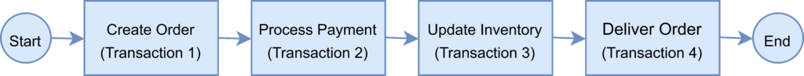
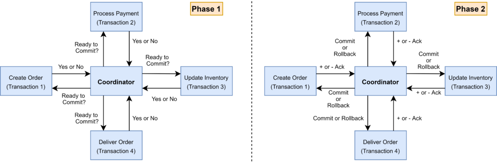
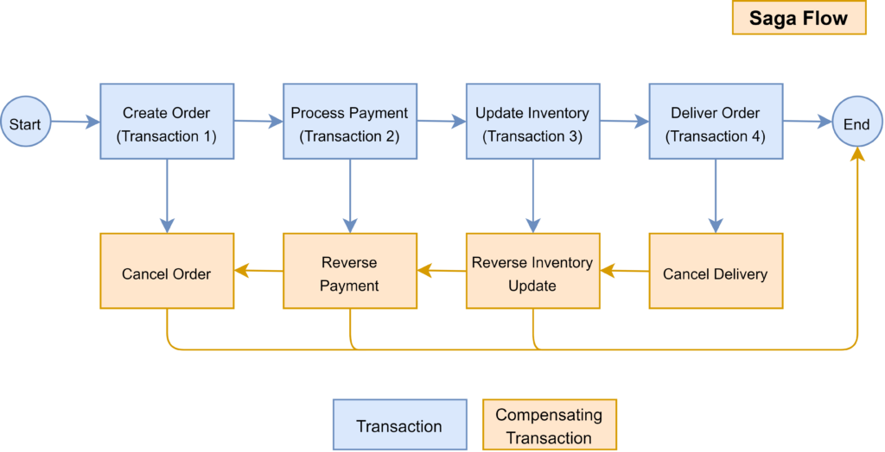

#Microservices
##SAGA Pattern:
####Problem Statement: 
In a Distributed Transaction, it is hard to maintain the ACID properties for the transactions.
In case of a transaction failure, it cannot be reverted thus compromising Atomicity.

####Solution:
To overcome this problem, there are two solutions 

* 2PC Pattern (2 Phase Coordinator): Prepare phase and commit phase, both phases are used to along with coordinator service to maintain the transaction.

  Although the above pattern may be useful, it leads to application failure when coordinator node fails.

* SAGA Pattern : In SAGA pattern, we have microservice at every point of failure to maintain the ACID property.
